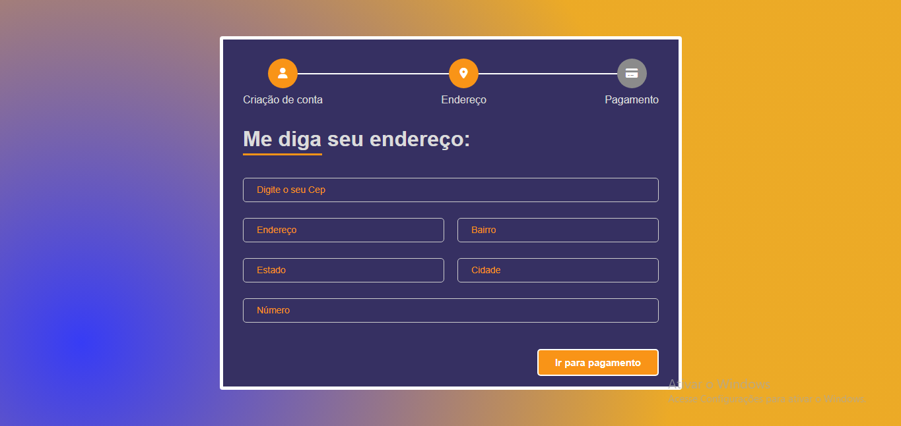

# Projeto com API de Cep 📬
Projeto feito para estudo de Funções assíncronas, fetch, API, Javascript, Html e Css

## Tecnologias 🚀
- HTML
- CSS
- JAVASCRIPT
- API via Cep

## Design 🎨

### Acesse o projeto pelo link abaixo: 

<a href="https://gabriell0610.github.io/API-Cep/">Projeto</a>

